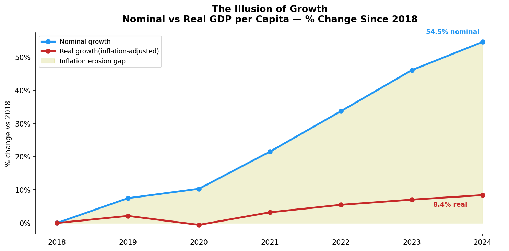
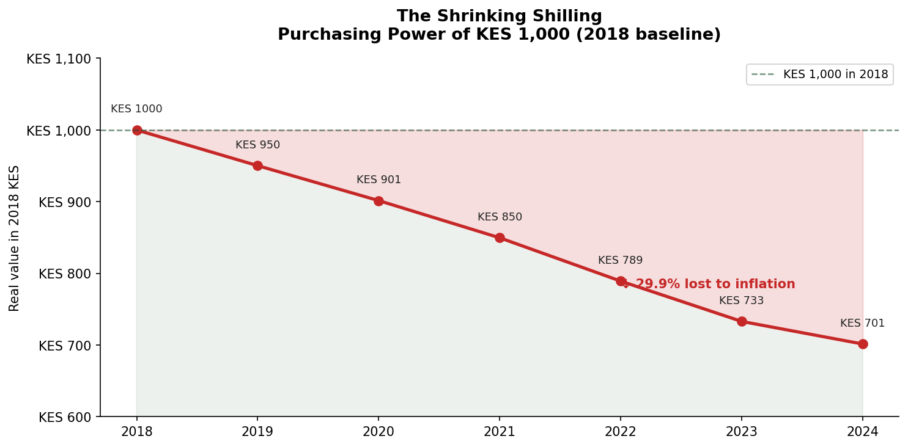
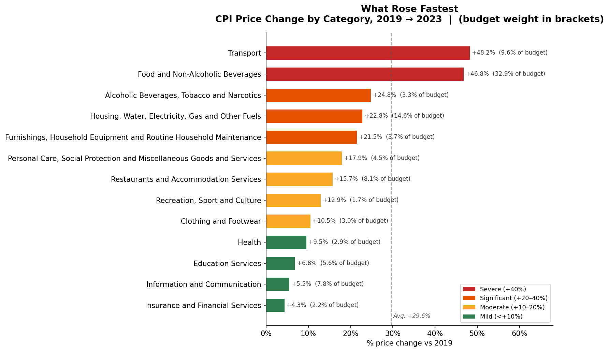
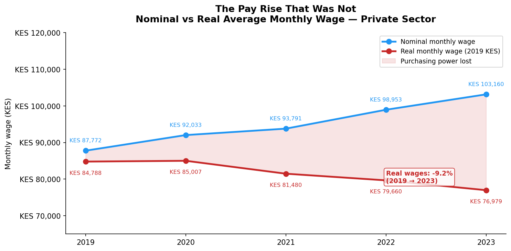
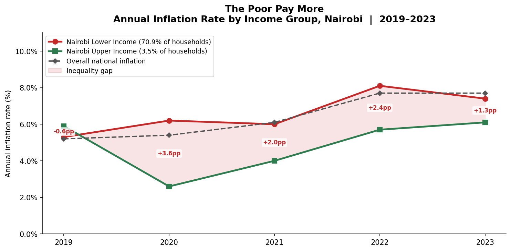
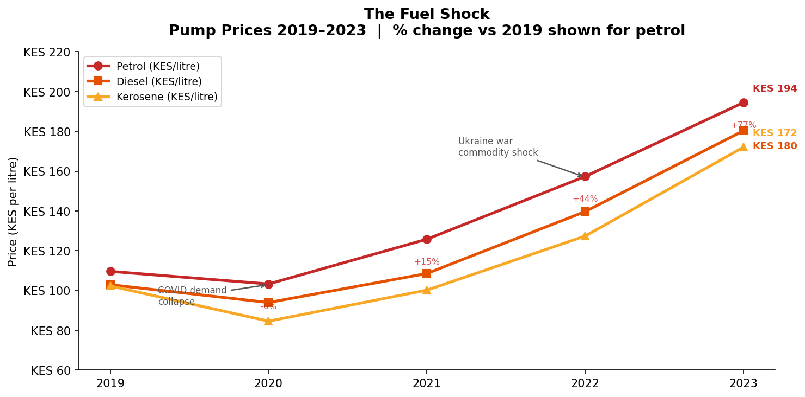

# 🇰🇪 The Real Cost of Being Kenyan
## An Economic Analysis of Income, Inflation & Purchasing Power | 2018–2024

> *Nominal GDP per capita grew 54.5% between 2018 and 2024.  
> Real GDP per capita grew 8.4%.  
> The difference is the story.*

---

## 📋 Project Overview

This project uses publicly available government and international data 
to answer one central question: **has the average Kenyan's real 
purchasing power actually improved — or has income growth been an 
illusion created by rising prices?**

The analysis covers inflation erosion, real wage decline, CPI category 
breakdowns, fuel price shocks, income inequality in inflation burden, 
and the fiscal policy context behind Kenya's cost of living crisis 
from 2018 to 2024.

**Tools used:** Python · pandas · matplotlib · seaborn · SQLite · 
Power BI · DAX

**Data sources:** World Bank · IMF WEO · KNBS Economic Survey 2024 · 
Central Bank of Kenya

---

## Key Findings

| Finding | Number |
|---------|--------|
| Nominal GDP/capita growth 2018–2024 | +54.5% |
| Real GDP/capita growth 2018–2024 | +8.4% |
| Purchasing power of KES 1,000 by 2024 | KES 701 |
| Real private sector wage change 2019–2023 | -9.2% |
| Food price increase 2019–2023 | +46.8% |
| Transport price increase 2019–2023 | +48.2% |
| Petrol price increase 2019–2023 | +77.4% |
| Peak government debt (2023) | 73.1% of GDP |
| Inflation gap: lower vs upper income (2020) | +3.6pp |
| Household health score 2023 | 1/5 — Critical |

---

## 📁 Project Structure
```
kenya-economic-analysis/
│
├── app.ipynb                 # Data ingestion & cleaning pipeline
├── eda.ipynb                 # Exploratory data analysis & charts
├── sql_analysis.ipynb        # SQLite analysis — 8 queries
│
├── data/
│   └── cleaned/              # 7 cleaned CSV files
│       ├── master_annual.csv         # Master dataset (7 rows × 45 cols)
│       ├── knbs_wages.csv            # Wages by sector & industry
│       ├── knbs_cpi_categories.csv   # CPI by 13 categories
│       ├── knbs_inflation_income.csv # Inflation by income group
│       ├── energy_fuel_prices.csv    # Fuel prices 2019–2023
│       ├── imf_macro.csv             # IMF fiscal indicators
│       └── wb_macro.csv              # World Bank macro indicators
│
└── visuals/
    ├── chart1_nominal_vs_real_growth.png
    ├── chart2_purchasing_power.png
    ├── chart3_cpi_by_category.png
    ├── chart4_nominal_vs_real_wages.png
    ├── chart5_inflation_by_income.png
    └── chart6_fuel_prices.png
```

---

## Charts

### The Illusion of Growth



### The Shrinking Shilling


### What Rose Fastest


### The Pay Rise That Was Not


### The Poor Pay More


### The Fuel Shock


---

## 🗄️ SQL Analysis

8 queries built against a SQLite database covering:

| Query | Concept | Question |
|-------|---------|----------|
| Q1 | SELECT, ROUND, aliases | Nominal vs real growth gap by year |
| Q2 | WHERE, CASE WHEN | Economic regime classification |
| Q3 | GROUP BY, aggregates | Wage summary by sector |
| Q4 | JOIN, subqueries | Worst real wage declines by industry |
| Q5 | HAVING, nested subquery | CPI categories beating national average |
| Q6 | LAG() window function | Year-on-year debt and savings shifts |
| Q7 | CTE, weighted index | Wage illusion vs household cost burden |
| Q8 | Composite scoring | Executive summary — household health |

---

## 🚀 How to Run

**Requirements:**
```bash
pip install pandas numpy matplotlib seaborn openpyxl xlrd
```

**Steps:**
1. Clone the repo
2. Download raw data files from sources listed in `app.ipynb`
3. Run `app.ipynb` to regenerate cleaned CSVs
4. Run `eda.ipynb` for charts
5. Run `sql_analysis.ipynb` for SQL analysis
6. Open Power BI dashboard — connect to `data/cleaned/` CSVs

---

## 📝 Data Sources

| Source | Data | Link |
|--------|------|------|
| World Bank Open Data | GDP, inflation | data.worldbank.org |
| IMF World Economic Outlook | Fiscal indicators | imf.org/en/Publications/WEO |
| KNBS Economic Survey 2024 | Wages, CPI, fuel | knbs.or.ke |
| Central Bank of Kenya | Exchange rates | centralbank.go.ke |

---

## 👤 Author

**[Your Name]**  
Data Analyst · Nairobi, Kenya  
[LinkedIn](#) · [GitHub](#)

*Built as a portfolio project demonstrating end-to-end data analysis 
across Python, SQL, and Power BI using real Kenyan economic data.*
